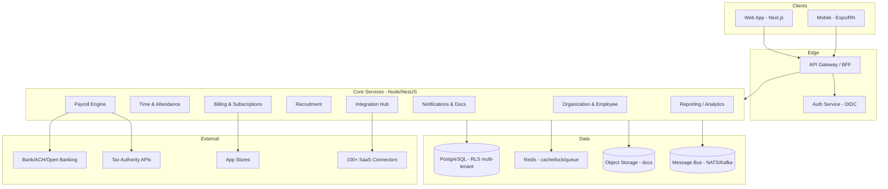
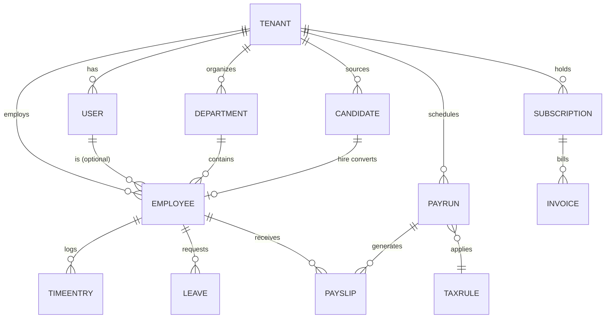

# Saasdesk — System Design

> Companion to `design.md` (landing-page/content spec).
> Product: **All-in-one Payroll & HR SaaS for SMBs** (web + iOS + Android).
> Status: greenfield design. Assumptions stated in §1; adjust as needed.

---

## 1. Assumptions & Scope

| # | Assumption | Rationale |
|---|---|---|
| A1 | Multi-tenant SaaS, SMBs (≈5–500 employees/tenant) | Landing page targets "small team", "startups and SMBs" |
| A2 | Single region at launch (US-first), data-residency ready | Payroll is jurisdiction-specific; start one tax locale |
| A3 | Web (Next.js) + native mobile (Expo/React Native) | Nav shows App Store + Google Play badges |
| A4 | Strong consistency for money/PII, eventual for analytics/notifications | Payroll must never lose precision or double-pay |
| A5 | Initial launch: one country's tax rules, pluggable rule engine for expansion | Avoids premature global tax modeling |
| A6 | Integrations launched via unified connector framework, not 100 bespoke builds | "100+ Tool Integrations" is a marketplace, not 100 services |

**Out of scope (v1):** global multi-currency payroll, native accounting ledger, benefits administration beyond basics, on-prem.

---

## 2. Architecture Overview



**Style:** service-per-domain (bounded contexts), synchronous REST for commands, GraphQL for dashboard reads, asynchronous event bus for side-effects (payslip generation, notifications, integration sync).

---

## 3. Tech Stack (defaults)

| Layer | Choice | Why |
|---|---|---|
| Web | Next.js + TypeScript + TanStack Query | SSR, app-router, mature ecosystem |
| Mobile | Expo (React Native) | Single JS codebase → App Store + Play |
| API gateway/BFF | NestJS or tRPC | Typed end-to-end; CQRS read models |
| Core services | Node.js + NestJS (TS) | Velocity; shared types with clients |
| Payroll Engine | Same TS service, **pure deterministic module** | Money math isolated, unit-testable, no I/O |
| Database | PostgreSQL 16 + Prisma/Drizzle | ACID, RLS for tenancy, JSONB for extensibility |
| Cache / locks | Redis | Idempotency keys, distributed locks for pay runs |
| Queue / events | NATS JetStream (or Kafka) | At-least-once, replayable payroll events |
| Storage | S3-compatible (docs, payslips, exports) | Durable, versioned |
| Search | PostgreSQL FTS (v1) → OpenSearch later | Candidate/employee search |
| Observability | OpenTelemetry + Prometheus + Grafana + pino | Trace every pay run |
| Infra | Containerized on a managed K8s (EKS/GKE) | Horizontal scale per service |
| CI/CD | GitHub Actions → container registry → GitOps | Standard, auditable |

---

## 4. Bounded Contexts (services)

### 4.1 Identity & Access (`AUTH`)
- OIDC/OAuth2, email+password + SSO (Google/Microsoft).
- RBAC: `Owner, Admin, Manager, HR, Employee, PayrollAdmin`.
- MFA for payroll-admin roles (compliance).

### 4.2 Organization & Employee (`ORG`)
- Tenant, legal entities, departments, positions.
- Employee profile: identity, compensation, bank details, tax info, documents.
- PII encrypted at rest (column-level KMS).

### 4.3 Time & Attendance (`TIME`)
- Clock-in/out, timesheets, shifts, leave requests/balances.
- Approvals workflow (manager → HR).

### 4.4 Payroll Engine (`PAY`) — highest-risk context
- **Pure function core:** `runPayroll(inputs) → PayRunResult` (no DB/network inside).
- Inputs: employees, time entries, compensation, tax rules, deductions.
- Outputs: per-employee payslips (gross, pre-tax deductions, tax, net), ledger entries, audit trail.
- Idempotent: pay run keyed by `(tenant, period, entity)`; re-run safe.
- Tax rule engine: pluggable per jurisdiction (v1: one locale).

### 4.5 Recruitment (`REC`)
- Job posts, candidates, pipeline stages, interviews, assessments.
- "Hire" converts a candidate → Employee (event to `ORG`).

### 4.6 Billing & Subscriptions (`BILL`)
- Plans (Free/Starter/Professional/Business from `design.md`), seats, usage.
- Invoicing, dunning, app-store IAP reconciliation.

### 4.7 Integration Hub (`INTG`)
- Connector framework: each integration = adapter (auth, transform, sync).
- Categories: accounting (QuickBooks/Xero), banks, calendar, identity, productivity.
- Webhook ingress + outbound sync; rate-limited, retry with backoff.

### 4.8 Notifications & Documents (`NOTIF`)
- Email/SMS/push; document templating (payslips, contracts) → S3 + signed URLs.
- Audit-log emission for every sensitive action.

### 4.9 Reporting / Analytics (`REP`)
- Read models (CQRS) built from event stream; dashboards, exports (CSV/PDF).

---

## 5. Data Model (core entities)



**Key tables (Postgres, all carry `tenant_id`):**

| Entity | Critical fields |
|---|---|
| `tenant` | id, name, region, plan, tax_locale, settings(JSONB) |
| `user` | id, tenant_id, email, password_hash, mfa, roles[] |
| `employee` | id, tenant_id, user_id?, legal_name, ssn_encrypted, hire_date, dept_id, comp(JSONB: salary/rate/currency), bank_encrypted, status |
| `time_entry` | id, employee_id, type(clock/shift/manual), start, end, approved_by |
| `leave` | id, employee_id, type, range, balance_snapshot, status |
| `pay_run` | id, tenant_id, entity_id, period_start, period_end, status(draft/running/done/locked), idempotency_key |
| `pay_item` | id, payslip_id, category(gross/deduction/tax/net), amount(DECIMAL 19,4), currency |
| `payslip` | id, pay_run_id, employee_id, gross, tax, net, pdf_ref, issued_at |
| `tax_rule` | id, locale, version, bracket(JSONB), effective_from |
| `candidate` | id, tenant_id, job_id, stage, score, documents[] |
| `subscription` | id, tenant_id, plan, seats, status, renews_at |
| `invoice` | id, subscription_id, amount, status, issued_at |

**Money:** `NUMERIC(19,4)`, all amounts in minor-unit-safe decimal; never `float`. Currency per tenant/entity.

---

## 6. Key Workflows

### 6.1 Payroll Run (critical path)
1. HR triggers `POST /payruns` with `(period, entity)`.
2. `PAY` acquires Redis lock + idempotency key.
3. Gather approved `time_entry` + `leave` for period.
4. `runPayroll()` pure compute → validates net ≥ 0, totals reconcile.
5. Persist `pay_run` (status `running`) + `pay_item`/`payslip` rows in one txn.
6. Emit `PayRunCompleted` → `INTG` pushes to bank/ACH; `NOTIF` emails payslips (signed S3 URLs).
7. `PAY` marks `locked`; any correction becomes a new *adjustment* run (never mutate locked run).

### 6.2 Employee Onboarding
Invite (`ORG`) → collect docs/PII → assign dept + compensation → enroll in next pay run → provision `USER` access.

### 6.3 Recruitment → Hire
`REC` pipeline → `Hire` event → `ORG` creates `employee` (reuses candidate PII, re-encrypted) → payroll enrollment.

### 6.4 Integration Sync
`INTG` polls webhooks → adapter transforms → writes via `ORG`/`TIME` APIs → ack. Failures: dead-letter + alert; no partial tenant corruption.

---

## 7. Multi-Tenancy & Isolation

- **Shared Postgres, row-level security** by `tenant_id` on every table; enforced via session `tenant_id` GUC + RLS policies (defense in depth beyond app-layer filtering).
- **PII columns** (SSN, bank) encrypted with per-tenant KMS data keys.
- **Redis** namespaced by `tenant_id:`; locks scoped to avoid cross-tenant contention.
- **Large/regulated tenants:** optional dedicated schema/DB (migration path, not v1 requirement).
- **Noisy-neighbor:** per-service autoscaling; pay-run jobs on isolated worker pool.

---

## 8. Security & Compliance (payroll-grade)

- **Encryption:** TLS 1.3 in transit; AES-256 + KMS at rest; envelope encryption for PII.
- **Auth:** OIDC, short-lived JWT + refresh, MFA for admin/payroll roles, session revocation.
- **Audit:** immutable append-only audit log for all money/PII actions (who/what/when/tenant).
- **Least privilege:** service-to-service mTLS; RBAC enforced at API + RLS.
- **Compliance targets:** GDPR (erasure, residency), SOC 2 (audit, access control), local taxrecord retention (e.g., 7 yr).
- **Payroll correctness:** deterministic engine, reconciliation assertions, locked runs, adjustment-only corrections.
- **Secrets:** vault (e.g., Doppler/HashiCorp); no secrets in env at rest.

---

## 9. Reliability & Scalability

- **Idempotency:** every mutating endpoint takes an idempotency key; safe retries (esp. pay runs, invoicing).
- **At-least-once + dedupe:** event bus delivers ≥1×; consumers dedupe on key.
- **Pay-run isolation:** dedicated worker pool; one concurrent run per `(tenant, entity, period)`.
- **Backpressure:** queue depth alerts; integration sync throttled per provider quota.
- **Data integrity:** DB constraints + money reconciliation invariants; CI runs property tests on `runPayroll`.
- **DR:** PITR (Postgres), multi-AZ, RPO < 5 min; object versioning in S3.

---

## 10. Observability

- **Traces:** every request + each pay-run step (OpenTelemetry).
- **Metrics:** pay-run duration/success, integration error rate, p95 API latency, queue depth.
- **Logs:** structured (`pino`), tenant-tagged, shipped to central store.
- **Alerts:** failed pay run, tax API outage, integration DLQ growth, anomalous net pay.

---

## 11. API Surface (examples)

```
POST   /auth/login                 # OIDC token
POST   /tenants/:id/employees      # onboard
GET    /tenants/:id/employees/:eid
POST   /tenants/:id/time-entries   # clock / timesheet
POST   /tenants/:id/payruns        # trigger payroll (idempotency-key)
GET    /tenants/:id/payruns/:rid   # status + payslips
GET    /tenants/:id/payslips/:pid  # signed PDF URL
POST   /tenants/:id/jobs           # recruitment post
POST   /tenants/:id/candidates/:id/hire
POST   /tenants/:id/integrations   # connect connector
GET    /graphql                    # dashboard reads (employees, runs, metrics)
```

---

## 12. Build Sequence (phased)

1. **Foundation:** tenancy/RLS, auth/RBAC, `ORG` + `EMPLOYEE`, CI/CD, observability.
2. **Time → Payroll:** `TIME` + pure `PAY` engine + reconciliation + payslip docs.
3. **Recruitment:** `REC` + hire→employee conversion.
4. **Billing:** `BILL` plans from `design.md` (fix the placeholder features first).
5. **Integrations:** `INTG` framework + first 5–10 connectors.
6. **Reporting:** `REP` read models + dashboards.
7. **Hardening:** compliance audit, pen-test, DR drill.

---

## 13. Open Decisions (need your call)

| Decision | Options | Recommendation |
|---|---|---|
| Backend language | Node/NestJS vs Go for all services | Node/NestJS + isolated pure TS payroll core (A4) |
| Read layer | REST-only vs add GraphQL | Add GraphQL for dashboard (A4 eventual reads) |
| Tenant isolation | Shared-DB+RLS vs per-tenant DB | Shared-DB+RLS v1, dedicated schema path later |
| Tax locale v1 | US (federal+state) vs EU vs other | US-first (A2/A5) |
| Message bus | NATS JetStream vs Kafka | NATS JetStream (simpler ops at SMB scale) |

Adjust any assumption and I'll revise the design or move to a module/code sketch.
---

## 14. Visual Design System (extracted from live Webflow CSS)

> Grounded in the published stylesheet `sasdesk.webflow.d0b31b99d.css`. These are the **actual** tokens — implement as CSS custom properties / design tokens, not re-invented values.

### 14.1 Typography

| Token | Font | Size / Line-height | Weight | Notes |
|---|---|---|---|---|
| Base `body` | **General Sans Variable** (`Generalsans Variable`), fallback `sans-serif` | 14px / 20px | 400 | Fontshare; weight range **200–700** |
| `display-h1` | General Sans Variable | 70px / 90px | 500 | letter-spacing -.01em |
| `section-title-h2` | General Sans Variable | 60px / 80px | 500 | ls -.02em |
| `h2` | General Sans Variable | 56px / 80px | 500 | |
| `h3` | General Sans Variable | 50px / 68px | 500 | |
| `h4` | General Sans Variable | 38px / 54px | 500 | |
| `h5` | General Sans Variable | 30px / 38px | 500 | |
| `h6` | General Sans Variable | 22px / 32px | 500 | |
| `upper-heading` | General Sans Variable | 13px / 24px | 600 | **uppercase**, ls .08em (eyebrow labels) |
| `body-large` | General Sans Variable | 20px / 37px | 500 | |
| `body-medium` | General Sans Variable | 18px / 34px | 500 | |
| `body-small` | General Sans Variable | 16px / 30px | 500 | |
| UI icons | `webflow-icons` (embedded) | — | — | slider/nav glyphs |

**Font source (self-host):** `https://assets.website-files.com/6543eed5397deb6f75475c49/6543eed5397deb6f75475c6d_GeneralSans-Variable.ttf` (weight 200–700). Self-host + `font-display: swap`; do **not** depend on the Webflow CDN in production.

**Responsive type (observed breakpoints):**
- Tablet `≤991px`: display-h1 → 60/80, section-title-h2 → 40/60.
- Mobile `≤767px`: display-h1 → 37.5/52, section-title-h2 → 28/38; cards drop to 40px padding / 30px radius.

### 14.2 Color Tokens

| CSS var | Hex | Role / Usage |
|---|---|---|
| `--color--dark` / `--color--heading` | `#2b2b46` | Primary text, headings, **footer bg**, **primary button bg** |
| `--color--grey` / `--color--body` | `#6a6a7a` | Body / secondary text |
| `--color--accent` | `#00acca` | Links, hovers, focus rings, **submit button**, nav active |
| `--color--blue-2` | `#d0f8ff` | Hero / utility / login section background |
| `--color--blue` | `#e6fbff` | Use-case "blue" block, nav-link hover bg, integration section bg |
| `--color--orange` | `#fff3e6` | Use-case block 1, review slide, pricing wrapper |
| `--color--green` | `#e6fff0` | Accent surface (pricing/feature) |
| `--color--yellow` | `#f8ffe6` | Use-case "yellow" block, **highlight-text pill** bg |
| `--color--purple` | `#e6e8ff` | Use-case "purple" (`puple`) block |
| `--color--pink` | `#f4d4eb` | Use-case section bg, **highlight-text pill** bg, pricing wrapper |
| `--color--white` | `#ffffff` | Surfaces, primary-button text |
| `--color--transparent` | `rgba(255,255,255,0)` | Overlays |
| (hardcoded) testimonial arrow | `#fbe274` | Yellow circle behind tag arrow |

**Palette character:** light, friendly pastel tints (near-white) on a dark-navy `#2b2b46` anchor, with a single teal `#00acca` accent. Highlighted words ("Payroll"/"HR" in hero) sit in yellow/pink pill backgrounds (`border-radius:100px`) with dark text.

⚠️ **Contrast check before build:** pastel card backgrounds with `#2b2b46` text pass; verify `#00acca` on white for small text (≈3.9:1 — borderline for <18px; use for ≥18px or non-text). Run axe/Lighthouse on the real UI.

### 14.3 Radius, Spacing, Elevation

| Token | Value | Usage |
|---|---|---|
| `--px--90` / `--px--100` / `--px--160` | 90 / 100 / 160px | Section vertical spacing (mobile / tablet / desktop) |
| Pill radius | `100px` | buttons, tags, nav links, inputs, highlight pills |
| Card radius | `30px` (mobile) / `50px` (use-case blocks) | surfaces |
| Navbar container | `160px` | floating pill nav (`max-width:1240px`, white bg) |
| Elevation | none declared | Flat pastel surfaces; separate with bg tint, not shadows |

### 14.4 Component Tokens

```css
/* Reference tokens — codify in tokens.css / Tailwind theme */
:root{
  --font-sans: "Generalsans Variable", sans-serif;
  --c-heading:#2b2b46; --c-body:#6a6a7a; --c-accent:#00acca;
  --c-blue-2:#d0f8ff; --c-blue:#e6fbff; --c-orange:#fff3e6;
  --c-green:#e6fff0; --c-yellow:#f8ffe6; --c-purple:#e6e8ff; --c-pink:#f4d4eb;
  --r-pill:100px; --r-card:30px;
  --space-section:160px;
}
```

- **Primary button** — bg `#2b2b46`, text `#fff`, radius `100px`, inline arrow glyph.
- **Secondary button** — `2px solid #2b2b46`, text heading color, radius `100px`; hover → bg `#2b2b46` / text `#fff`. Variant `.white` inverts for dark sections.
- **Input field** — `2px solid rgba(34,37,71,.2)`, radius `100px`, height `52px`; focus border `#00acca`.
- **Submit button** — bg `#00acca`, radius `100px`, full-width.
- **Nav link** — radius `50px`; hover bg `#e6fbff` / text `#00acca`; active = accent.

### 14.5 Frontend Token Strategy

1. Self-host General Sans; expose `--font-sans` + weight axis.
2. Mirror the `:root` vars above as the single source of truth (CSS vars or a `theme.ts` consumed by Tailwind `theme.extend`).
3. Pastel surfaces are **semantic** (`--surface-use-case-blue`, etc.), not raw hex, so re-theming is one edit.
4. Encode the 3 breakpoints (991 / 767) in the layout system; type scale already responsive in source.
5. Add an automated contrast/lint gate (e.g., a11y token check) so pastel-on-pastel regressions fail CI.
